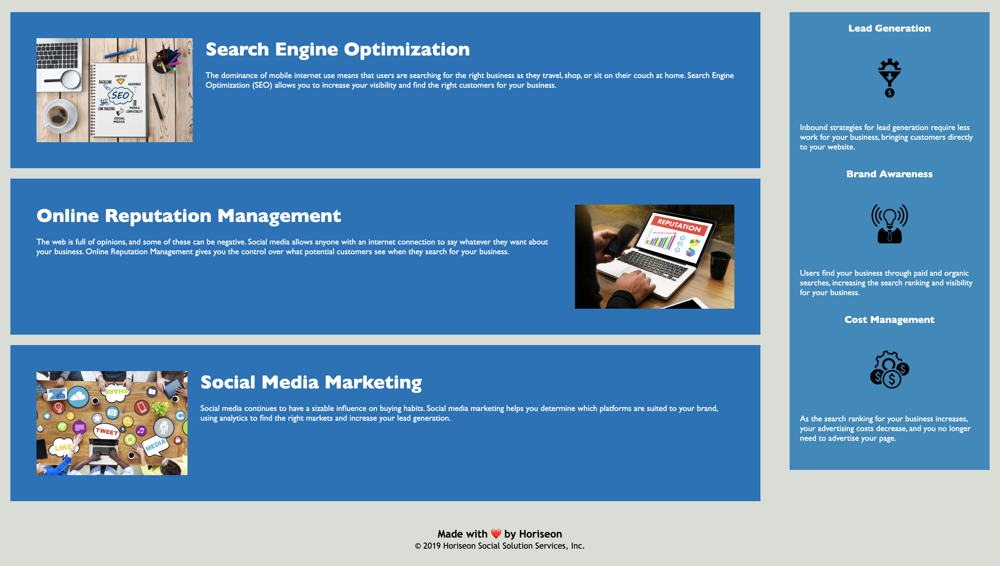

# <Refactor-Accesibilility>

## Description

This project took an existing repo encoding the Horiseon webpage and refactored it for greater accessibility. The index.html file was restructured to incorporate semantic 
elements. This increased readability of the html file for future collaboraters working to improve the website. Additionally, alt descriptions were added to images to increase webpage accessbibility. This project highlights the importance of project readability in both the deployed application and coding scripts. 

## Table of Contents (Optional)

If your README is long, add a table of contents to make it easy for users to find what they need.

- [Installation](#installation)
- [Usage](#usage)
- [Credits](#credits)
- [License](#license)

## Installation

No installation is required for this project other than a working web browser application application.

## Usage

Click the link below and the application will open in your default web browser:
________

The webpage has links in the navigation bar that direct you to different pages. These are still under construction, however, and will not take you anywhere.

The rest of the webpage shows information in written and visual form for how Horiseon can be used to help your company.

Below are screenshots of the deployed webpage.

## Credits

Berkeley Coding Bootcamp

## License

NA